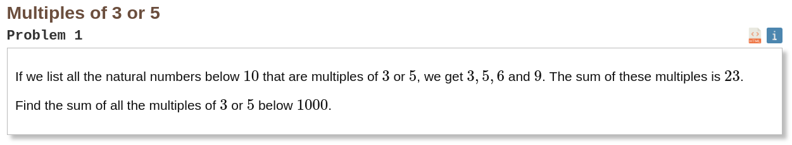

### My Eular Problemset Solutions

##### [Project Eular](https://projecteuler.net/archives)

[Problem 1: Multiples of 3 or 5](https://projecteuler.net/problem=1)
- Question:



- Solution:
``` JS
// get the sum of all numbers that are multiplies of 3 or 5 below 1000

function sum(list) {
  let total = 0;
  for (let i = 0; i < list.length; i++) {
    total += list[i];
  }
  return total;
}

function getSumOfMultiplies() {
  let numbers = [];
  for (let i = 0; i < 1000; i++) {
    if (i % 3 === 0 || i % 5 === 0) {
      numbers.push(i);
    }
  }
  return sum(numbers);
}

console.log(getSumOfMultiplies());
// 233168
```