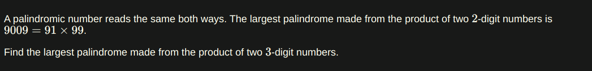

### My Eular Problemset Solutions

[Project Eular's Link](https://projecteuler.net/archives)

[Problem 1: Multiples of 3 or 5](https://projecteuler.net/problem=1)
- Question:


- Solution:
``` JS
function sum(list) {
  let total = 0;
  for (let i = 0; i < list.length; i++) {
    total += list[i];
  }
  return total;
}

function getSumOfMultiplies() {
  let numbers = [];
  for (let i = 0; i < 1000; i++) {
    if (i % 3 === 0 || i % 5 === 0) {
      numbers.push(i);
    }
  }
  return sum(numbers);
}

console.log(getSumOfMultiplies());
// 233168
```

[Problem 2: Even Fibonacci Numbers](https://projecteuler.net/problem=2)

- Question:


- Solution

``` JS
const MAX_VALUE = 4000000;

function sum(list) {
  let total = 0;
  for (let i = 0; i < list.length; i++) {
    total += list[i];
  }
  return total;
}

function fib() {
  let numbers = [];
  let a = 1;
  let b = 1;
  for (;;) {
    let c = a + b;

    if (c % 2 == 0) {
      numbers.push(c);
    }
    a = b;
    b = c;

    if (a >= MAX_VALUE) {
      break;
    }
  }
  return sum(numbers);
}
console.log(fib());
// 4613732
```

[Problem 3: Largest Prime Factor](https://projecteuler.net/problem=3)

- Question:


- Solution:

``` JS
const TARGET = 60085147;
// rest 5143 removed for performance issues

const TEST = 13195;

function getLargetPrimeFactor() {
  return getMax(makePrimeFactorsList());
}

function getMax(list) {
  if (list.length > 0) {
    let max = list[0];
    for (let i = 1; i < list.length; i++) {
      if (list[i] > max) {
        max = list[i];
      }
    }
    return max;
  }
}

function makePrimeFactorsList() {
  return makeFactorsList().filter((num) => checkPrime(num));
}

function checkPrime(num) {
  if (num <= 1) {
    return false;
  } else {
    for (let i = 2; i * i <= num; i++) {
      if (num % i === 0) {
        return false;
      }
    }
    return true;
  }
}

function makeFactorsList() {
  let factors = [];
  let target = TARGET
  for (let i = 2; i <= target; i++) {
    if (target % i === 0) {
      factors.push(i);
    }
  }
  return factors;
}

console.log(getLargetPrimeFactor());
// 1397329
```

[Problem 4: Largest Palindrome Product](https://projecteuler.net/problem=4)

- Question:



- Solution:

``` JS
function checkPalindrome(num) {
  return (num + "").split("").reverse().join("") === num + "";
}

function getMax(list) {
  if (list.length > 0) {
    let max = list[0];
    for (let i = 1; i < list.length; i++) {
      if (list[i] > max) {
        max = list[i];
      }
    }
    return max;
  }
}

function makePalindromesList() {
  let pList = [];
  for (let i = 100; i <= 999; i++) {
    for (let j = 100; j <= 999; j++) {
      let multiplied = i * j;
      if (checkPalindrome(multiplied)) {
        pList.push(multiplied);
      }
    }
  }
  return pList;
}

function getLargestPalindrome() {
  return getMax(makePalindromesList());
}

console.log(getLargestPalindrome());
// 906609
```
[Problem 5: Smallest Multiple](https://projecteuler.net/problem=5)

- Question: 


- Solution:

``` JS
function getSmallest(start, end) {
  let found = false
  let number = end - start
  while(!found) {
    for(let i = start; i <= end; i++){
      if (number % i === 0){
        found = true
      }
      else {
        number += 1
        found = false
        break
      }
    }
  }
  return number
}

console.log(getSmallest(1, 20)) // 232792560
console.log(getSmallest(1, 10)) // 2520
```