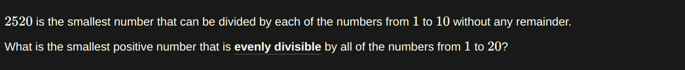
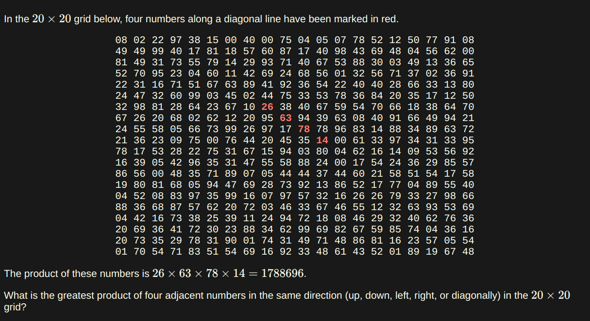

### My Eular Problemset Solutions

[Project Eular's Link](https://projecteuler.net/archives)

[Problem 1: Multiples of 3 or 5](https://projecteuler.net/problem=1)
- Question:


- Solution:
``` JS
function sum(list) {
  let total = 0;
  for (let i = 0; i < list.length; i++) {
    total += list[i];
  }
  return total;
}

function getSumOfMultiplies() {
  let numbers = [];
  for (let i = 0; i < 1000; i++) {
    if (i % 3 === 0 || i % 5 === 0) {
      numbers.push(i);
    }
  }
  return sum(numbers);
}

console.log(getSumOfMultiplies());
// 233168
```

[Problem 2: Even Fibonacci Numbers](https://projecteuler.net/problem=2)

- Question:


- Solution

``` JS
const MAX_VALUE = 4000000;

function sum(list) {
  let total = 0;
  for (let i = 0; i < list.length; i++) {
    total += list[i];
  }
  return total;
}

function fib() {
  let numbers = [];
  let a = 1;
  let b = 1;
  for (;;) {
    let c = a + b;

    if (c % 2 == 0) {
      numbers.push(c);
    }
    a = b;
    b = c;

    if (a >= MAX_VALUE) {
      break;
    }
  }
  return sum(numbers);
}
console.log(fib());
// 4613732
```

[Problem 3: Largest Prime Factor](https://projecteuler.net/problem=3)

- Question:


- Solution:

``` JS
const TARGET = 600851475143;

function getLargestPrimeFactor(number) {
  let i = 2
  while( i * i < number) {
    while(number % i === 0) {
      number /= i
    }
    i += 1
  }
  return number
}

console.log(getLargestPrimeFactor(TARGET))
// 6857
```

[Problem 4: Largest Palindrome Product](https://projecteuler.net/problem=4)

- Question:


- Solution:

``` JS
function checkPalindrome(num) {
  return (num + "").split("").reverse().join("") === num + "";
}

function getMax(list) {
  if (list.length > 0) {
    let max = list[0];
    for (let i = 1; i < list.length; i++) {
      if (list[i] > max) {
        max = list[i];
      }
    }
    return max;
  }
}

function makePalindromesList() {
  let pList = [];
  for (let i = 100; i <= 999; i++) {
    for (let j = 100; j <= 999; j++) {
      let multiplied = i * j;
      if (checkPalindrome(multiplied)) {
        pList.push(multiplied);
      }
    }
  }
  return pList;
}

function getLargestPalindrome() {
  return getMax(makePalindromesList());
}

console.log(getLargestPalindrome());
// 906609
```
[Problem 5: Smallest Multiple](https://projecteuler.net/problem=5)

- Question: 



- Solution:

``` JS
function getSmallest(start, end) {
  let found = false
  let number = end - start
  while(!found) {
    for(let i = start; i <= end; i++){
      if (number % i === 0){
        found = true
      }
      else {
        number += 1
        found = false
        break
      }
    }
  }
  return number
}

console.log(getSmallest(1, 20)) // 232792560
console.log(getSmallest(1, 10)) // 2520
```

[Problem 6: Sum Square Difference](https://projecteuler.net/problem=6)

- Question:


- Solution:

``` JS
function sumOfTheSquares(start = 1, end = 100) {
  let sum = 0;
  for (let i = start; i <= end; i++) {
    let squared = i * i;
    sum += squared;
  }
  return sum;
}

function squareOfTheSum(start = 1, end = 100) {
  let sum = 0;
  for (let i = start; i <= end; i++) {
    sum += i;
  }
  return sum * sum;
}

function theDifference() {
  return squareOfTheSum() - sumOfTheSquares();
}

function testDifference() {
  return squareOfTheSum(1, 10) - sumOfTheSquares(1, 10);
}

console.log(theDifference()); // 25164150
console.log(testDifference()); // 2640
```

[Problem 7: 10,001th Prime](https://projecteuler.net/problem=7)

- Question:


- Solution:

``` JS
const LIMIT = 10001

function isPrime(n) {
  if(n <= 1){
    return false
  } else {
    for(let i = 2; i * i <= n; i++){
      if(n % i === 0){
        return false
      }
    }
    return true
  }
}

function makePrimesList() {
  let primesList = []
  let currentNum = 0
  while (LIMIT >= primesList.length) {
    if(isPrime(currentNum)) {
      primesList.push(currentNum)
    }
    currentNum += 1
  }
  return primesList
}

function get_nthPrime(list, nthPlace) {
  return list[nthPlace - 1]
}

console.log(get_nthPrime(makePrimesList(), LIMIT))
// 104743
```

[Problem 8: Largest Product in a Series](https://projecteuler.net/problem=8)

- Question: 


- Solution:

``` JS
let series =
  "7316717653133062491922511967442657474235534919493496983520312774506326239578318016984801869478851843858615607891129494954595017379583319528532088055111254069874715852386305071569329096329522744304355766896648950445244523161731856403098711121722383113622298934233803081353362766142828064444866452387493035890729629049156044077239071381051585930796086670172427121883998797908792274921901699720888093776657273330010533678812202354218097512545405947522435258490771167055601360483958644670632441572215539753697817977846174064955149290862569321978468622482839722413756570560574902614079729686524145351004748216637048440319989000889524345065854122758866688116427171479924442928230863465674813919123162824586178664583591245665294765456828489128831426076900422421902267105562632111110937054421750694165896040807198403850962455444362981230987879927244284909188845801561660979191338754992005240636899125607176060588611646710940507754100225698315520005593572972571636269561882670428252483600823257530420752963450";

const NUM_OF_ADJECENTS = 13;

function getProduct(str) {
  return [...str].reduce((curr, prev) => +curr * +prev, 1)
}

function getMaxProduct(str) {
  // create all subsets that has no zero
  let product = 1
  let numbers
  max = getProduct(str.slice(0,13))
  for(let i = 0; i < str.length - NUM_OF_ADJECENTS; i++){
    let subset = str.slice(i, i+NUM_OF_ADJECENTS)
    if(stringDoesntHasZero(subset)){
      product = getProduct(subset)
      if(product > max) {
        numbers = [...subset].map(number => parseInt(number))
        max = product
      }
    }
  }
  return { value: max, numbers }
}

function stringDoesntHasZero(str) {
  if([...str].includes('0')) {
    return false
  }
  return true
}

console.log(getMaxProduct(series))
// {
//   value: 23514624000,
//   numbers: [
//     5, 5, 7, 6, 6, 8,
//     9, 6, 6, 4, 8, 9,
//     5
//   ]
// }
```

[Problem 9: Special Pythagorean Triplet](https://projecteuler.net/problem=9)

- Question: 


- Solution:

``` JS
function pythagoreanRule(a, b, c) {
  return Math.sqrt(a * a + b * b) === c;
}

function getSpecialPythagoreanTriplet() {
  for (let a = 1; a <= 200; a++) {
    for (let b = a + 1; b <= 400; b++) {
      for (let c = b + 1; c <= 450; c++) {
        if (pythagoreanRule(a, b, c) && a + b + c === 1000) {
          return { a, b, c };
        }
      }
    }
  }
}

function getProductABC() {
  return (
    getSpecialPythagoreanTriplet().a *
    getSpecialPythagoreanTriplet().b *
    getSpecialPythagoreanTriplet().c
  );
}

console.log(getSpecialPythagoreanTriplet());
// {a: 200, b: 375, c: 425}

console.log(getProductABC());
// 31875000
```

[Problem 10: Summation of Primes](https://projecteuler.net/problem=10)

- Question:


- Solution:

``` JS 
const MAX_PRIME = 2000000

function checkPrime(num) {
  if (num <= 1) {
    return false;
  } else {
    for (let i = 2; i * i <= num; i++) {
      if (num % i === 0) {
        return false;
      }
    }
    return true;
  }
}

function sum(list) {
  let total = 0;
  for (let i = 0; i < list.length; i++) {
    total += list[i];
  }
  return total;
}

function makePrimesList(start = 2, end = MAX_PRIME) {
  let pList = []
  for(let i = start; i <= end; i++){
    if(checkPrime(i)) {
      pList.push(i)
    }
  }
  return pList
}

function sumOfPrimes() {
  return sum(makePrimesList())
}

console.log(sumOfPrimes())
// 142913828922
```

[Problem 11: Largest Product in a Grid](https://projecteuler.net/problem=11)

- Question: 



- Solution: 

``` JS
const grid = [
  [ 8, 2,22,97,38,15, 0,40, 0,75, 4, 5, 7,78,52,12,50,77,91, 8],
  [49,49,99,40,17,81,18,57,60,87,17,40,98,43,69,48, 4,56,62, 0],
  [81,49,31,73,55,79,14,29,93,71,40,67,53,88,30, 3,49,13,36,65],
  [52,70,95,23, 4,60,11,42,69,24,68,56, 1,32,56,71,37, 2,36,91],
  [22,31,16,71,51,67,63,89,41,92,36,54,22,40,40,28,66,33,13,80],
  [24,47,32,60,99, 3,45, 2,44,75,33,53,78,36,84,20,35,17,12,50],
  [32,98,81,28,64,23,67,10,26,38,40,67,59,54,70,66,18,38,64,70],
  [67,26,20,68, 2,62,12,20,95,63,94,39,63, 8,40,91,66,49,94,21],
  [24,55,58, 5,66,73,99,26,97,17,78,78,96,83,14,88,34,89,63,72],
  [21,36,23, 9,75, 0,76,44,20,45,35,14, 0,61,33,97,34,31,33,95],
  [78,17,53,28,22,75,31,67,15,94, 3,80, 4,62,16,14, 9,53,56,92],
  [16,39, 5,42,96,35,31,47,55,58,88,24, 0,17,54,24,36,29,85,57],
  [86,56, 0,48,35,71,89, 7, 5,44,44,37,44,60,21,58,51,54,17,58],
  [19,80,81,68, 5,94,47,69,28,73,92,13,86,52,17,77, 4,89,55,40],
  [ 4,52, 8,83,97,35,99,16, 7,97,57,32,16,26,26,79,33,27,98,66],
  [88,36,68,87,57,62,20,72, 3,46,33,67,46,55,12,32,63,93,53,69],
  [ 4,42,16,73,38,25,39,11,24,94,72,18, 8,46,29,32,40,62,76,36],
  [20,69,36,41,72,30,23,88,34,62,99,69,82,67,59,85,74, 4,36,16],
  [20,73,35,29,78,31,90, 1,74,31,49,71,48,86,81,16,23,57, 5,54],
  [ 1,70,54,71,83,51,54,69,16,92,33,48,61,43,52, 1,89,19,67,48]
]

const NUM_OF_ADJACENTS = 4

function horizontalAdj(list) {
  let hList = [], h1,h2,h3,h4, hItems = []
  for(let j = 0; j < list.length; j++) {
    for(let i = 0; i < list[j].length - NUM_OF_ADJACENTS; i++){
      h1 = list[j][i+0]
      h2 = list[j][i+1]
      h3 = list[j][i+2]
      h4 = list[j][i+3]
      hItems = [h1,h2,h3,h4]
      if(!hItems.includes(0)) {
        hList.push(hItems)
      }
    }
  }
  return hList
}

function verticalAdj(list) {
  let vList = [], v1,v2,v3,v4, vItems = []
  for(let j = 0; j < list.length - NUM_OF_ADJACENTS; j++){
    for(let i = 0; i < list[j].length; i++){
      v1 = list[j+0][i]
      v2 = list[j+1][i]
      v3 = list[j+2][i]
      v4 = list[j+3][i]
      vItems = [v1,v2,v3,v4]
      if(!vItems.includes(0)) {
        vList.push(vItems)
      }
    }
  }
  return vList
}

function makeDiagonalRight(list) {
  let drList = [], dr1, dr2, dr3, dr4, drItems = []
  for(let i = 0; i < list.length - NUM_OF_ADJACENTS; i++){
    for(let j = 0; j < list[i].length - NUM_OF_ADJACENTS; j++) {
      dr1 = list[i + 0][j + 0]
      dr2 = list[i + 1][j + 1]
      dr3 = list[i + 2][j + 2]
      dr4 = list[i + 3][j + 3]
      drItems = [dr1, dr2, dr3, dr4]
      if(!drItems.includes(0)) {
        drList.push(drItems)
      }
    }
  }
  return drList
}

function makeDiagonalLeft(list) {
  let dlList = [], dl1, dl2, dl3, dl4, dlItems = []
  for(let i = 0; i < list.length - NUM_OF_ADJACENTS; i++){
    for(let j = NUM_OF_ADJACENTS - 1; j < list[i].length j++){
      dl1 = list[i + 0][j - 0]
      dl2 = list[i + 1][j - 1]
      dl3 = list[i + 2][j - 2]
      dl4 = list[i + 3][j - 3]
      dlItems = [dl1, dl2, dl3, dl4]
      if(!dlItems.includes(0)) {
        dlList.push(dlItems)
      }
    }
  }
  return dlList
}

function concatHorizontalAndVertical() {
  return horizontalAdj(grid).concat(verticalAdj(grid))
}

function allDiagonals() {
  return makeDiagonalRight(grid).concat(makeDiagonalLeft(grid))
}

function everyAdjacentPossible() {
  return concatHorizontalAndVertical().concat(allDiagonals())
}

function makeProducts() {
  let pList = []
  const allAdjacents = everyAdjacentPossible()
  pList = allAdjacents.map(adjListItem => getProduct(adjListItem))
  return pList
}

function getProduct(list) {
  let productOfList = 1
  for(let i = 0; i < list.length; i++){
    productOfList *= list[i]
  }
  return { product: productOfList, numbers: list }
}

function getLargestProductGrid() {
  return makeProducts(grid).sort((a,b) => b.product - a.product)[0]
}

console.log(getLargestProductGrid())
// { product: 70600674, numbers: [ 89, 94, 97, 87 ] }
```

[Problem 12: Highly Divisible Triangular Number](https://projecteuler.net/problem=12)

- Question: 


- Solution:

``` JS
function countDivisors(num) {
  let numberOfDivisors = 2
  for(let i = 1; i <= Math.floor(Math.sqrt(num)); i++){
    if(num % i === 0){
      numberOfDivisors += 2
    }
  }
  return numberOfDivisors
}

function findTriangularNumber(minDivisors){
  let n = 1
  let triangularNumber
  while(true){
    triangularNumber = (n * ( n + 1 )) / 2
    if(countDivisors(triangularNumber) > minDivisors){
      return triangularNumber
    }
    n++
  }
}

const result = findTriangularNumber(500)
console.log(result)
// 76576500
```

[Problem 13: Large Sum](https://projecteuler.net/problem=13)

- Question: 


- Solution:

``` JS
const numbers = [
  "37107287533902102798797998220837590246510135740250",
  "46376937677490009712648124896970078050417018260538",
  "74324986199524741059474233309513058123726617309629",
  "91942213363574161572522430563301811072406154908250",
  "23067588207539346171171980310421047513778063246676",
  "89261670696623633820136378418383684178734361726757",
  "28112879812849979408065481931592621691275889832738",
  "44274228917432520321923589422876796487670272189318",
  "47451445736001306439091167216856844588711603153276",
  "70386486105843025439939619828917593665686757934951",
  "62176457141856560629502157223196586755079324193331",
  "64906352462741904929101432445813822663347944758178",
  "92575867718337217661963751590579239728245598838407",
  "58203565325359399008402633568948830189458628227828",
  "80181199384826282014278194139940567587151170094390",
  "35398664372827112653829987240784473053190104293586",
  "86515506006295864861532075273371959191420517255829",
  "71693888707715466499115593487603532921714970056938",
  "54370070576826684624621495650076471787294438377604",
  "53282654108756828443191190634694037855217779295145",
  "36123272525000296071075082563815656710885258350721",
  "45876576172410976447339110607218265236877223636045",
  "17423706905851860660448207621209813287860733969412",
  "81142660418086830619328460811191061556940512689692",
  "51934325451728388641918047049293215058642563049483",
  "62467221648435076201727918039944693004732956340691",
  "15732444386908125794514089057706229429197107928209",
  "55037687525678773091862540744969844508330393682126",
  "18336384825330154686196124348767681297534375946515",
  "80386287592878490201521685554828717201219257766954",
  "78182833757993103614740356856449095527097864797581",
  "16726320100436897842553539920931837441497806860984",
  "48403098129077791799088218795327364475675590848030",
  "87086987551392711854517078544161852424320693150332",
  "59959406895756536782107074926966537676326235447210",
  "69793950679652694742597709739166693763042633987085",
  "41052684708299085211399427365734116182760315001271",
  "65378607361501080857009149939512557028198746004375",
  "35829035317434717326932123578154982629742552737307",
  "94953759765105305946966067683156574377167401875275",
  "88902802571733229619176668713819931811048770190271",
  "25267680276078003013678680992525463401061632866526",
  "36270218540497705585629946580636237993140746255962",
  "24074486908231174977792365466257246923322810917141",
  "91430288197103288597806669760892938638285025333403",
  "34413065578016127815921815005561868836468420090470",
  "23053081172816430487623791969842487255036638784583",
  "11487696932154902810424020138335124462181441773470",
  "63783299490636259666498587618221225225512486764533",
  "67720186971698544312419572409913959008952310058822",
  "95548255300263520781532296796249481641953868218774",
  "76085327132285723110424803456124867697064507995236",
  "37774242535411291684276865538926205024910326572967",
  "23701913275725675285653248258265463092207058596522",
  "29798860272258331913126375147341994889534765745501",
  "18495701454879288984856827726077713721403798879715",
  "38298203783031473527721580348144513491373226651381",
  "34829543829199918180278916522431027392251122869539",
  "40957953066405232632538044100059654939159879593635",
  "29746152185502371307642255121183693803580388584903",
  "41698116222072977186158236678424689157993532961922",
  "62467957194401269043877107275048102390895523597457",
  "23189706772547915061505504953922979530901129967519",
  "86188088225875314529584099251203829009407770775672",
  "11306739708304724483816533873502340845647058077308",
  "82959174767140363198008187129011875491310547126581",
  "97623331044818386269515456334926366572897563400500",
  "42846280183517070527831839425882145521227251250327",
  "55121603546981200581762165212827652751691296897789",
  "32238195734329339946437501907836945765883352399886",
  "75506164965184775180738168837861091527357929701337",
  "62177842752192623401942399639168044983993173312731",
  "32924185707147349566916674687634660915035914677504",
  "99518671430235219628894890102423325116913619626622",
  "73267460800591547471830798392868535206946944540724",
  "76841822524674417161514036427982273348055556214818",
  "97142617910342598647204516893989422179826088076852",
  "87783646182799346313767754307809363333018982642090",
  "10848802521674670883215120185883543223812876952786",
  "71329612474782464538636993009049310363619763878039",
  "62184073572399794223406235393808339651327408011116",
  "66627891981488087797941876876144230030984490851411",
  "60661826293682836764744779239180335110989069790714",
  "85786944089552990653640447425576083659976645795096",
  "66024396409905389607120198219976047599490197230297",
  "64913982680032973156037120041377903785566085089252",
  "16730939319872750275468906903707539413042652315011",
  "94809377245048795150954100921645863754710598436791",
  "78639167021187492431995700641917969777599028300699",
  "15368713711936614952811305876380278410754449733078",
  "40789923115535562561142322423255033685442488917353",
  "44889911501440648020369068063960672322193204149535",
  "41503128880339536053299340368006977710650566631954",
  "81234880673210146739058568557934581403627822703280",
  "82616570773948327592232845941706525094512325230608",
  "22918802058777319719839450180888072429661980811197",
  "77158542502016545090413245809786882778948721859617",
  "72107838435069186155435662884062257473692284509516",
  "20849603980134001723930671666823555245252804609722",
  "53503534226472524250874054075591789781264330331690"
]

function largeSum(numArr) {
  let sum = 0
  let sumStr
  let first10digits

  numArr.forEach(number => {
    sum+=+number
    })
  sumStr = sum.toLocaleString('fullwide', {useGrouping: false})
  first10digits = sumStr.slice(0,10)

  return parseInt(first10digits)
}

console.log(largeSum(numbers))
// 5537376230
```

[Problem 14: Longest Collatz Sequence](https://projecteuler.net/problem=14)

- Question: 


- Solution

``` JS
function nextInSequence(prevNumber) {
  if(prevNumber % 2 === 0){
    return prevNumber / 2
  }
  return (prevNumber * 3) + 1
}

function generateSequence(startingNumber) {
  let chainLength = 1
  let current = startingNumber
  while(current !== 1){
    chainLength += 1
    current = nextInSequence(current)
  }
  return { chainLength, startingNumber }
}

function largestCollatzSequence() {
  let allSequences = []
  for(let i = 2; i < 1000000; i++){
    allSequences.push(generateSequence(i))
  }
  return allSequences.sort((a, b) => b.chainLength - a.chainLength)[0]
}

let result = largestCollatzSequence()
console.log(result)
// { 
//  chainLength: 525, 
//  startingNumber: 837799 
// }
```

[Problem 15: Lattice Paths](https://projecteuler.net/problem=15)

- Question:


- Solution:

``` JS
const gridSize = 20
const pathMoves = gridSize * 2

function factorial(n) {
  if (n == 1){
    return 1
  }else {
    return n * factorial(n - 1)
  }
}

const mathFormula = (factorial(pathMoves) / (factorial(gridSize) * factorial(gridSize)))
console.log(mathFormula)
// 137846528820
```

[Problem 16: Power Digit Sum](https://projecteuler.net/problem=16)

- Question:


- Solution:

``` JS
let number = BigInt(2) ** BigInt(1000)

function getSum(str) {
  return [...str].reduce((curr, prev) => +curr + +prev)
}

console.log(getSum(number.toString()))
// 1366
```

[Problem 17: Number Letter Counts](https://projecteuler.net/problem=17)

- Question:


- Solution:

``` JS 
const below20 = [
  0,
  "one".length,
  "two".length,
  "three".length,
  "four".length,
  "five".length,
  "six".length,
  "seven".length,
  "eigth".length,
  "nine".length,
  "ten".length,
  "eleven".length,
  "twelve".length,
  "thirteen".length,
  "fourteen".length,
  "fifteen".length,
  "sixteen".length,
  "seventeen".length,
  "eighteen".length,
  "nineteen".length,
];

const endingWithZero = {
  20: "twenty".length,
  30: "thirty".length,
  40: "forty".length,
  50: "fifty".length,
  60: "sixty".length,
  70: "seventy".length,
  80: "eighty".length,
  90: "ninety".length,
};

const hunderds = {
  100: "onehundred".length,
  200: "twohundred".length,
  300: "threehundred".length,
  400: "fourhundred".length,
  500: "fivehundred".length,
  600: "sixhundred".length,
  700: "sevenhundred".length,
  800: "eighthundred".length,
  900: "ninehundred".length,
};

function countLetters(number) {
  if (number < 20) {
    return below20[number];
  } else if (number >= 20 && number < 100) {
    if (number % 10 === 0) {
      return endingWithZero[number];
    } else {
      let nn = countLetters(Math.floor(number / 10) * 10);
      let n = countLetters(number % 10);
      return nn + n;
    }
  } else if (number >= 100 && number < 1000) {
    if (number % 100 === 0) {
      return hunderds[number];
    } else {
      let nnn = countLetters(Math.floor(number / 100) * 100);
      let digitTwo = Math.floor(number / 10) % 10;
      if (digitTwo === 1) {
        let nn = countLetters(10 + (number % 10));
        return nnn + nn + 3;
      }
      let nn = countLetters((Math.floor(number / 10) % 10) * 10);
      let n = countLetters(number % 10);
      return nnn + nn + n + 3;
    }
  } else if (number === 1000) {
    return "onethousand".length;
  }
}

function solution(limit) {
  let total = 0;
  for (let i = 1; i <= limit; i++) {
    total += countLetters(i);
  }
  return total;
}

const result = solution(1000);
console.log(result);
// 21124
```

[Problem 18: Number Letter Counts](https://projecteuler.net/problem=18)

- Question:


- Solution:

``` JS 
const traingle = [
  [75],
  [95, 64],
  [17, 47, 82],
  [18, 35, 87, 10],
  [20,  4, 82, 47, 65],
  [19,  1, 23, 75,  3, 34],
  [88,  2, 77, 73,  7, 63, 67],
  [99, 65,  4, 28,  6, 16, 70, 92],
  [41, 41, 26, 56, 83, 40, 80, 70, 33],
  [41, 48, 72, 33, 47, 32, 37, 16, 94, 29],
  [53, 71, 44, 65, 25, 43, 91, 52, 97, 51, 14],
  [70, 11, 33, 28, 77, 73, 17, 78, 39, 68, 17, 57],
  [91, 71, 52, 38, 17, 14, 91, 43, 58, 50, 27, 29, 48],
  [63, 66,  4, 68, 89, 53, 67, 30, 73, 16, 69, 87, 40, 31],
  [ 4, 62, 98, 27, 23,  9, 70, 98, 73, 93, 38, 53, 60,  4, 23]
]

function maximumPathSum() {
  for(let i = traingle.length - 2; i >= 0; i--) {
    for(let j = 0; j < traingle[i].length; j++) {
      traingle[i][j] += Math.max(traingle[i+1][j], traingle[i+1][j+1])
    }
  }
  return traingle[0][0]
}

let result = maximumPathSum()
console.log(result)
// 1074
```