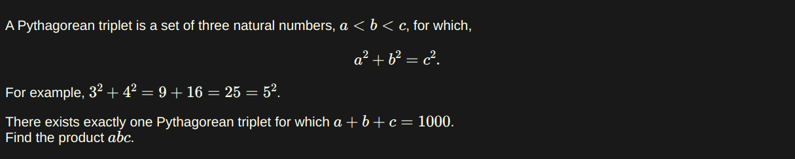

### My Eular Problemset Solutions

[Project Eular's Link](https://projecteuler.net/archives)

[Problem 1: Multiples of 3 or 5](https://projecteuler.net/problem=1)
- Question:


- Solution:
``` JS
function sum(list) {
  let total = 0;
  for (let i = 0; i < list.length; i++) {
    total += list[i];
  }
  return total;
}

function getSumOfMultiplies() {
  let numbers = [];
  for (let i = 0; i < 1000; i++) {
    if (i % 3 === 0 || i % 5 === 0) {
      numbers.push(i);
    }
  }
  return sum(numbers);
}

console.log(getSumOfMultiplies());
// 233168
```

[Problem 2: Even Fibonacci Numbers](https://projecteuler.net/problem=2)

- Question:


- Solution

``` JS
const MAX_VALUE = 4000000;

function sum(list) {
  let total = 0;
  for (let i = 0; i < list.length; i++) {
    total += list[i];
  }
  return total;
}

function fib() {
  let numbers = [];
  let a = 1;
  let b = 1;
  for (;;) {
    let c = a + b;

    if (c % 2 == 0) {
      numbers.push(c);
    }
    a = b;
    b = c;

    if (a >= MAX_VALUE) {
      break;
    }
  }
  return sum(numbers);
}
console.log(fib());
// 4613732
```

[Problem 3: Largest Prime Factor](https://projecteuler.net/problem=3)

- Question:


- Solution:

``` JS
const TARGET = 60085147;
// rest 5143 removed for performance issues

const TEST = 13195;

function getLargetPrimeFactor() {
  return getMax(makePrimeFactorsList());
}

function getMax(list) {
  if (list.length > 0) {
    let max = list[0];
    for (let i = 1; i < list.length; i++) {
      if (list[i] > max) {
        max = list[i];
      }
    }
    return max;
  }
}

function makePrimeFactorsList() {
  return makeFactorsList().filter((num) => checkPrime(num));
}

function checkPrime(num) {
  if (num <= 1) {
    return false;
  } else {
    for (let i = 2; i * i <= num; i++) {
      if (num % i === 0) {
        return false;
      }
    }
    return true;
  }
}

function makeFactorsList() {
  let factors = [];
  let target = TARGET
  for (let i = 2; i <= target; i++) {
    if (target % i === 0) {
      factors.push(i);
    }
  }
  return factors;
}

console.log(getLargetPrimeFactor());
// 1397329
```

[Problem 4: Largest Palindrome Product](https://projecteuler.net/problem=4)

- Question:


- Solution:

``` JS
function checkPalindrome(num) {
  return (num + "").split("").reverse().join("") === num + "";
}

function getMax(list) {
  if (list.length > 0) {
    let max = list[0];
    for (let i = 1; i < list.length; i++) {
      if (list[i] > max) {
        max = list[i];
      }
    }
    return max;
  }
}

function makePalindromesList() {
  let pList = [];
  for (let i = 100; i <= 999; i++) {
    for (let j = 100; j <= 999; j++) {
      let multiplied = i * j;
      if (checkPalindrome(multiplied)) {
        pList.push(multiplied);
      }
    }
  }
  return pList;
}

function getLargestPalindrome() {
  return getMax(makePalindromesList());
}

console.log(getLargestPalindrome());
// 906609
```
[Problem 5: Smallest Multiple](https://projecteuler.net/problem=5)

- Question: 


- Solution:

``` JS
function getSmallest(start, end) {
  let found = false
  let number = end - start
  while(!found) {
    for(let i = start; i <= end; i++){
      if (number % i === 0){
        found = true
      }
      else {
        number += 1
        found = false
        break
      }
    }
  }
  return number
}

console.log(getSmallest(1, 20)) // 232792560
console.log(getSmallest(1, 10)) // 2520
```

[Problem 6: Sum Square Difference](https://projecteuler.net/problem=6)

- Question:


- Solution:

``` JS
function sumOfTheSquares(start = 1, end = 100) {
  let sum = 0;
  for (let i = start; i <= end; i++) {
    let squared = i * i;
    sum += squared;
  }
  return sum;
}

function squareOfTheSum(start = 1, end = 100) {
  let sum = 0;
  for (let i = start; i <= end; i++) {
    sum += i;
  }
  return sum * sum;
}

function theDifference() {
  return squareOfTheSum() - sumOfTheSquares();
}

function testDifference() {
  return squareOfTheSum(1, 10) - sumOfTheSquares(1, 10);
}

console.log(theDifference()); // 25164150
console.log(testDifference()); // 2640
```

[Problem 7: 10,001th Prime](https://projecteuler.net/problem=7)

- Question:


- Solution:

``` JS
const LIMIT = 10001

function isPrime(n) {
  if(n <= 1){
    return false
  } else {
    for(let i = 2; i * i <= n; i++){
      if(n % i === 0){
        return false
      }
    }
    return true
  }
}

function makePrimesList() {
  let primesList = []
  let currentNum = 0
  while (LIMIT >= primesList.length) {
    if(isPrime(currentNum)) {
      primesList.push(currentNum)
    }
    currentNum += 1
  }
  return primesList
}

function get_nthPrime(list, nthPlace) {
  return list[nthPlace - 1]
}

console.log(get_nthPrime(makePrimesList(), LIMIT))
// 104743
```

[Problem 8: Largest Product in a Series](https://projecteuler.net/problem=8)

- Question: 


- Solution:

``` JS
let series =
  "7316717653133062491922511967442657474235534919493496983520312774506326239578318016984801869478851843858615607891129494954595017379583319528532088055111254069874715852386305071569329096329522744304355766896648950445244523161731856403098711121722383113622298934233803081353362766142828064444866452387493035890729629049156044077239071381051585930796086670172427121883998797908792274921901699720888093776657273330010533678812202354218097512545405947522435258490771167055601360483958644670632441572215539753697817977846174064955149290862569321978468622482839722413756570560574902614079729686524145351004748216637048440319989000889524345065854122758866688116427171479924442928230863465674813919123162824586178664583591245665294765456828489128831426076900422421902267105562632111110937054421750694165896040807198403850962455444362981230987879927244284909188845801561660979191338754992005240636899125607176060588611646710940507754100225698315520005593572972571636269561882670428252483600823257530420752963450";

const NUM_OF_ADJECENTS = 13;

function getMax(list) {
  if (list.length > 0) {
    let maxValue = list[0].value;
    let maxNums = list[0].numbers;
    for (let i = 1; i < list.length; i++) {
      if (list[i].value > maxValue) {
        maxValue = list[i].value;
        maxNums = list[i].numbers;
      }
    }
    return { value: maxValue, numbers: maxNums };
  }
}

function filterData() {
  const noZeroes = series.split("0");
  const valid = noZeroes.filter((item) => item.length >= NUM_OF_ADJECENTS);
  const datasetStr = valid.map((item) => item.split(""));
  const datasetInt = datasetStr.map((itemArr) =>
    itemArr.map((item) => parseInt(item))
  );

  return datasetInt;
}

function makeProductAndReturnMaxOne(arr) {
  let n1, n2, n3, n4, n5, n6, n7, n8, n9, n10, n11, n12, n13, product, max;
  let theNumbers
  max =
    arr[0] *
    arr[1] *
    arr[2] *
    arr[3] *
    arr[4] *
    arr[5] *
    arr[6] *
    arr[7] *
    arr[8] *
    arr[9] *
    arr[10] *
    arr[11] *
    arr[12];
  for (let i = 1; i < arr.length - NUM_OF_ADJECENTS; i++) {
    n1 = arr[i + 0];
    n2 = arr[i + 1];
    n3 = arr[i + 2];
    n4 = arr[i + 3];
    n5 = arr[i + 4];
    n6 = arr[i + 5];
    n7 = arr[i + 6];
    n8 = arr[i + 7];
    n9 = arr[i + 8];
    n10= arr[i + 9];
    n11= arr[i + 10];
    n12= arr[i + 11];
    n13= arr[i + 12];

    product =
      n1 * n2 * n3 * n4 * n5 * n6 * n7 * n8 * n9 * n10 * n11 * n12 * n13;

    if (product >= max) {
      theNumbers = [n1, n2, n3, n4, n5, n6, n7, n8, n9, n10, n11, n12, n13];
      max = product;
    }
  }
  return {
    numbers: theNumbers,
    value: max,
  };
}

function maxProdutsArray() {
  return filterData().map((itemArr) => makeProductAndReturnMaxOne(itemArr));
}

function getLargestProduct() {
  return getMax(maxProdutsArray());
}

console.log(getLargestProduct());
// {
//   value: 14108774400,
//   numbers: [
//     3, 5, 5, 7, 6, 6,
//     8, 9, 6, 6, 4, 8,
//     9
//   ]
// }
```

[Problem 9: Special Pythagorean Triplet](https://projecteuler.net/problem=9)

- Question: 



- Solution:

``` JS
function pythagoreanRule(a, b, c) {
  return Math.sqrt(a * a + b * b) === c;
}

function getSpecialPythagoreanTriplet() {
  for (let a = 1; a <= 200; a++) {
    for (let b = a + 1; b <= 400; b++) {
      for (let c = b + 1; c <= 450; c++) {
        if (pythagoreanRule(a, b, c) && a + b + c === 1000) {
          return { a, b, c };
        }
      }
    }
  }
}

function getProductABC() {
  return (
    getSpecialPythagoreanTriplet().a *
    getSpecialPythagoreanTriplet().b *
    getSpecialPythagoreanTriplet().c
  );
}

console.log(getSpecialPythagoreanTriplet());
// {a: 200, b: 375, c: 425}

console.log(getProductABC());
// 31875000
```

[Problem 10: Summation of Primes](https://projecteuler.net/problem=10)

- Question:


- Solution:

``` JS 
const MAX_PRIME = 2000000

function checkPrime(num) {
  if (num <= 1) {
    return false;
  } else {
    for (let i = 2; i * i <= num; i++) {
      if (num % i === 0) {
        return false;
      }
    }
    return true;
  }
}

function sum(list) {
  let total = 0;
  for (let i = 0; i < list.length; i++) {
    total += list[i];
  }
  return total;
}

function makePrimesList(start = 2, end = MAX_PRIME) {
  let pList = []
  for(let i = start; i <= end; i++){
    if(checkPrime(i)) {
      pList.push(i)
    }
  }
  return pList
}

function sumOfPrimes() {
  return sum(makePrimesList())
}

console.log(sumOfPrimes())
// 142913828922
```

[Problem 11: Largest Product in a Grid](https://projecteuler.net/problem=11)

- Question: 


- Solution: 

``` JS
const grid = [
  [ 8, 2,22,97,38,15, 0,40, 0,75, 4, 5, 7,78,52,12,50,77,91, 8],
  [49,49,99,40,17,81,18,57,60,87,17,40,98,43,69,48, 4,56,62, 0],
  [81,49,31,73,55,79,14,29,93,71,40,67,53,88,30, 3,49,13,36,65],
  [52,70,95,23, 4,60,11,42,69,24,68,56, 1,32,56,71,37, 2,36,91],
  [22,31,16,71,51,67,63,89,41,92,36,54,22,40,40,28,66,33,13,80],
  [24,47,32,60,99, 3,45, 2,44,75,33,53,78,36,84,20,35,17,12,50],
  [32,98,81,28,64,23,67,10,26,38,40,67,59,54,70,66,18,38,64,70],
  [67,26,20,68, 2,62,12,20,95,63,94,39,63, 8,40,91,66,49,94,21],
  [24,55,58, 5,66,73,99,26,97,17,78,78,96,83,14,88,34,89,63,72],
  [21,36,23, 9,75, 0,76,44,20,45,35,14, 0,61,33,97,34,31,33,95],
  [78,17,53,28,22,75,31,67,15,94, 3,80, 4,62,16,14, 9,53,56,92],
  [16,39, 5,42,96,35,31,47,55,58,88,24, 0,17,54,24,36,29,85,57],
  [86,56, 0,48,35,71,89, 7, 5,44,44,37,44,60,21,58,51,54,17,58],
  [19,80,81,68, 5,94,47,69,28,73,92,13,86,52,17,77, 4,89,55,40],
  [ 4,52, 8,83,97,35,99,16, 7,97,57,32,16,26,26,79,33,27,98,66],
  [88,36,68,87,57,62,20,72, 3,46,33,67,46,55,12,32,63,93,53,69],
  [ 4,42,16,73,38,25,39,11,24,94,72,18, 8,46,29,32,40,62,76,36],
  [20,69,36,41,72,30,23,88,34,62,99,69,82,67,59,85,74, 4,36,16],
  [20,73,35,29,78,31,90, 1,74,31,49,71,48,86,81,16,23,57, 5,54],
  [ 1,70,54,71,83,51,54,69,16,92,33,48,61,43,52, 1,89,19,67,48]
]

const NUM_OF_ADJACENTS = 4

function horizontalAdj(list) {
  let hList = [], h1,h2,h3,h4, hItems = []
  for(let j = 0; j < list.length; j++) {
    for(let i = 0; i < list[j].length - NUM_OF_ADJACENTS; i++){
      h1 = list[j][i+0]
      h2 = list[j][i+1]
      h3 = list[j][i+2]
      h4 = list[j][i+3]
      hItems = [h1,h2,h3,h4]
      if(!hItems.includes(0)) {
        hList.push(hItems)
      }
    }
  }
  return hList
}

function verticalAdj(list) {
  let vList = [], v1,v2,v3,v4, vItems = []
  for(let j = 0; j < list.length - NUM_OF_ADJACENTS; j++){
    for(let i = 0; i < list[j].length; i++){
      v1 = list[j+0][i]
      v2 = list[j+1][i]
      v3 = list[j+2][i]
      v4 = list[j+3][i]
      vItems = [v1,v2,v3,v4]
      if(!vItems.includes(0)) {
        vList.push(vItems)
      }
    }
  }
  return vList
}

function makeDiagonalRight(list) {
  let drList = [], dr1, dr2, dr3, dr4, drItems = []
  for(let i = 0; i < list.length - NUM_OF_ADJACENTS; i++){
    for(let j = 0; j < list[i].length - NUM_OF_ADJACENTS; j++) {
      dr1 = list[i + 0][j + 0]
      dr2 = list[i + 1][j + 1]
      dr3 = list[i + 2][j + 2]
      dr4 = list[i + 3][j + 3]
      drItems = [dr1, dr2, dr3, dr4]
      if(!drItems.includes(0)) {
        drList.push(drItems)
      }
    }
  }
  return drList
}

function makeDiagonalLeft(list) {
  let dlList = [], dl1, dl2, dl3, dl4, dlItems = []
  for(let i = 0; i < list.length - NUM_OF_ADJACENTS; i++){
    for(let j = NUM_OF_ADJACENTS - 1; j < list[i].length j++){
      dl1 = list[i + 0][j - 0]
      dl2 = list[i + 1][j - 1]
      dl3 = list[i + 2][j - 2]
      dl4 = list[i + 3][j - 3]
      dlItems = [dl1, dl2, dl3, dl4]
      if(!dlItems.includes(0)) {
        dlList.push(dlItems)
      }
    }
  }
  return dlList
}

function concatHorizontalAndVertical() {
  return horizontalAdj(grid).concat(verticalAdj(grid))
}

function allDiagonals() {
  return makeDiagonalRight(grid).concat(makeDiagonalLeft(grid))
}

function everyAdjacentPossible() {
  return concatHorizontalAndVertical().concat(allDiagonals())
}

function makeProducts() {
  let pList = []
  const allAdjacents = everyAdjacentPossible()
  pList = allAdjacents.map(adjListItem => getProduct(adjListItem))
  return pList
}

function getProduct(list) {
  let productOfList = 1
  for(let i = 0; i < list.length; i++){
    productOfList *= list[i]
  }
  return { product: productOfList, numbers: list }
}

function getLargestProductGrid() {
  return makeProducts(grid).sort((a,b) => b.product - a.product)[0]
}

console.log(getLargestProductGrid())
// { product: 70600674, numbers: [ 89, 94, 97, 87 ] }
```

[Problem 12: Highly Divisible Triangular Number](https://projecteuler.net/problem=12)

- Question: 


- Solution:

``` JS
function countDivisors(num) {
  let numberOfDivisors = 2
  for(let i = 1; i <= Math.floor(Math.sqrt(num)); i++){
    if(num % i === 0){
      numberOfDivisors += 2
    }
  }
  return numberOfDivisors
}

function findTriangularNumber(minDivisors){
  let n = 1
  let triangularNumber
  while(true){
    triangularNumber = ( n * ( n + 1 )) / 2
    if(countDivisors(triangularNumber) > minDivisors){
      return triangularNumber
    }
    n++
  }
}

const result = findTriangularNumber(500)
console.log(result)
// 76576500
```