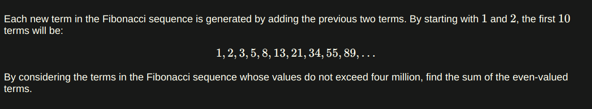

### My Eular Problemset Solutions

[Project Eular's Link](https://projecteuler.net/archives)

[Problem 1: Multiples of 3 or 5](https://projecteuler.net/problem=1)
- Question:


- Solution:
``` JS
// get the sum of all numbers that are multiplies of 3 or 5 below 1000

function sum(list) {
  let total = 0;
  for (let i = 0; i < list.length; i++) {
    total += list[i];
  }
  return total;
}

function getSumOfMultiplies() {
  let numbers = [];
  for (let i = 0; i < 1000; i++) {
    if (i % 3 === 0 || i % 5 === 0) {
      numbers.push(i);
    }
  }
  return sum(numbers);
}

console.log(getSumOfMultiplies());
// 233168
```

[Problem 2: Even Fibonacci Numbers](https://projecteuler.net/problem=2)

- Question:


- Solution

``` JS
// get the sum of even numbers in the fibonacci sequence

const MAX_VALUE = 4000000;

function sum(list) {
  let total = 0;
  for (let i = 0; i < list.length; i++) {
    total += list[i];
  }
  return total;
}

function fib() {
  let numbers = [];
  let a = 1;
  let b = 1;
  for (;;) {
    let c = a + b;

    if (c % 2 == 0) {
      numbers.push(c);
    }
    a = b;
    b = c;

    if (a >= MAX_VALUE) {
      break;
    }
  }
  return sum(numbers);
}
console.log(fib());
// 4613732
```